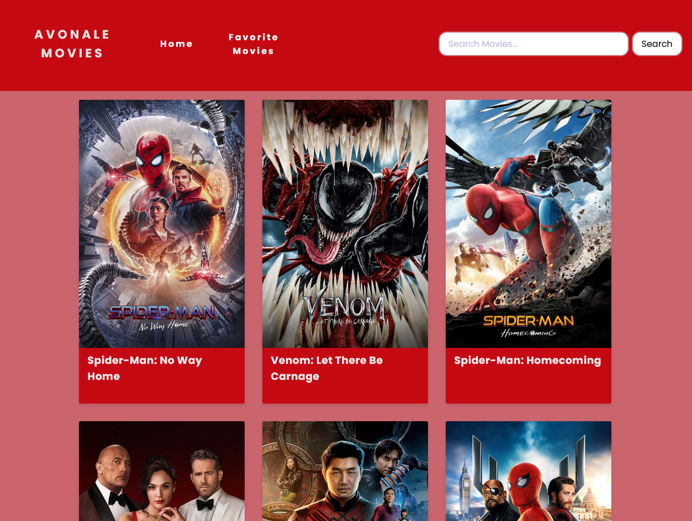

<h1>Português:</h1>

<h1>avonale-movies</h1>

Este repositório é destinado a um desafio de código proposto pela empresa Avonale. A aplicação foi desenvolvida utilizando o VueJs via CDN.

<h2>Como Executar o Projeto</h2>

Para executar o projeto, basta executar o arquivo HTML em um navegador compatível (Preferencialmente Google Chrome ou Microsoft Edge).

<h3>Requisitos Propostos pela Empresa</h3>

<h4>1. Requisitos Básicos</h4>

- Consumir a The Movie Databse API;
- Exibir uma página inicial com os filmes mais populares;
- Exibir uma página com detalhes do filme selecionado;

<h3>2. Requisitos Extras</h3>

- Utilizar alguma gerência de estado;

- Adicionar uma caixa de busca na tela inicial e exibir resultados em uma nova página;

- Permitir que o usuário adicione/remova filmes da página inicial como favoritos e fazer a  persistência de dados;

- Exibir os filmes favoritados em uma nova página que permita a remoção destes;

  

<h1>English:</h1>

<h1>avonale-movies</h1>

This repository is a code challenge proposed by the Avonale company. The application was developed using VueJs via CDN.

<h2>How to Execute the Project</h2>

To run the project, just run the HTML file in a supported browser (Ideally Google Chrome or Microsoft Edge). 

<h3>Requirements proposed by the company</h3>

<h4>1. Basic Requirements</h4>

- Consume The Movie Database API;
- Show a Home Page with the most popular  movies;
- Show a page with details about the selected movie;

<h4>2. Extra Requirements</h4>

- State Manegement;
- Add a search box at the main screen to exibit the search results in a new page;
- Allow the user to add/remove movies from the main page as favorites and persist the data;
- Exibit the favorite movies in a new page that allows the user to exclude any movie he/she wants;
